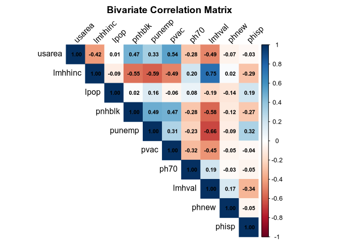
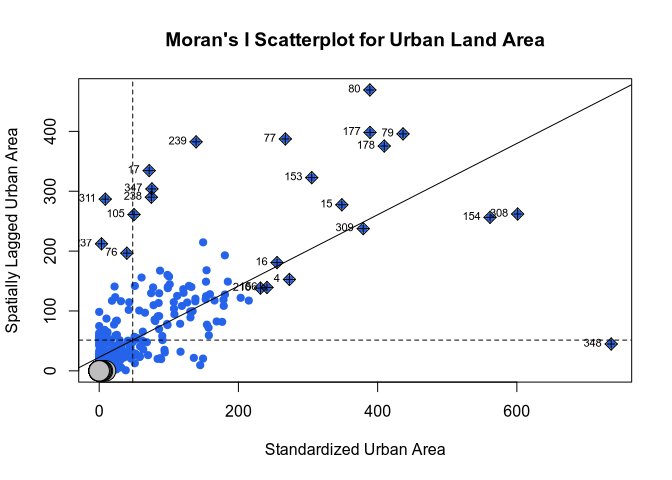
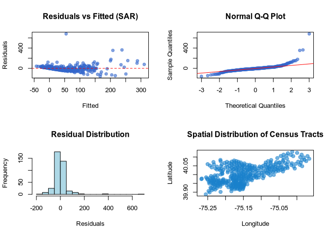

# Urban Spatial Econometrics & Machine Learning
Muhammad Riesya Attaya
2026-09-16

- [Executive Summary](#executive-summary)
- [Environment Setup & Automated Data
  Ingestion](#environment-setup--automated-data-ingestion)
- [Exploratory Data Analysis (EDA)](#exploratory-data-analysis-eda)
- [Spatial Weight Matrix & Global Moran’s I
  Test](#spatial-weight-matrix--global-morans-i-test)
- [Ordinary Least Squares (OLS) Baseline &
  Diagnostics](#ordinary-least-squares-ols-baseline--diagnostics)
- [Spatial Econometric Models: SAR
  vs. SEM](#spatial-econometric-models-sar-vs-sem)
- [Model Comparison & Residual
  Diagnostics](#model-comparison--residual-diagnostics)
- [Interpretation & Policy
  Implications](#interpretation--policy-implications)
  - [1. Empirical Confirmation of Spatial
    Autocorrelation](#1-empirical-confirmation-of-spatial-autocorrelation)
  - [2. Comparative Model Superiority: SAR
    vs. SEM](#2-comparative-model-superiority-sar-vs-sem)
  - [3. Urban Planning & Regional Policy
    Insights](#3-urban-planning--regional-policy-insights)

## Executive Summary

This study models spatial dependencies at the census tract level across
Philadelphia, Pennsylvania. By empirically evaluating the classical
Ordinary Least Squares (OLS) assumption of independent observations, we
test for spatial autocorrelation using **Moran’s I** and **Lagrange
Multiplier Diagnostics**, followed by comparative estimation of
**Spatial Autoregressive (SAR)** and **Spatial Error Model (SEM)**
specifications.

The primary response variable is `usarea` (urban spatial land-use
characteristics), modeled against demographic and socio-economic
predictors: - `lmhhinc`: Log median household income - `lpop`: Log total
population - `pnhblk`: Proportion non-Hispanic Black residents -
`punemp`: Proportion unemployed civilian labor force - `pvac`:
Proportion vacant housing units - `ph70`: Proportion housing structures
built prior to 1970 - `lmhval`: Log median housing valuation - `phnew`:
Proportion recently constructed housing - `phisp`: Proportion Hispanic
residents

------------------------------------------------------------------------

## Environment Setup & Automated Data Ingestion

Spatial polygon data is ingested directly from the public repository in
ESRI Shapefile format, projected into WGS84 coordinates, and centroid
geometries are extracted for spatial matrix construction.

``` r
options(repos = c(CRAN = "https://cloud.r-project.org"))

required_packages <- c(
  "tidyverse", "sf", "spdep", "spatialreg", "ggplot2", 
  "corrplot", "nortest", "lmtest", "car"
)

for (pkg in required_packages) {
  if (!requireNamespace(pkg, quietly = TRUE)) {
    install.packages(pkg, repos = "https://cloud.r-project.org")
  }
  library(pkg, character.only = TRUE)
}

# Automated Data Ingestion
if (!file.exists("phil_tracts.shp")) {
  download.file(url = "https://raw.githubusercontent.com/crd230/data/master/phil_tracts.zip",
                destfile = "phil_tracts.zip", quiet = TRUE)
  unzip(zipfile = "phil_tracts.zip")
}

data_sf <- st_read("phil_tracts.shp", quiet = TRUE)

df_with_coords <- data_sf %>%
  st_centroid() %>% 
  st_transform(4326) %>%
  mutate(
    longitude = st_coordinates(.)[,1],
    latitude  = st_coordinates(.)[,2]
  ) %>%
  st_drop_geometry()

cat("Total Census Tracts Analyzed:", nrow(df_with_coords), "\n")
```

    Total Census Tracts Analyzed: 376 

``` r
head(df_with_coords[, c("usarea", "lmhhinc", "lpop", "punemp", "lmhval", "longitude", "latitude")])
```

         usarea   lmhhinc     lpop    punemp   lmhval longitude latitude
    1 134.19121  9.820541 8.324579 0.1923559 11.08521 -75.23225 39.96328
    2 178.56621 10.229476 8.028129 0.1231190 10.98190 -75.23792 39.96588
    3 178.94036 10.102420 8.369157 0.1520468 11.17325 -75.24351 39.96555
    4 273.22482 10.258852 7.658700 0.1584821 11.28477 -75.17718 39.97646
    5  87.41617  9.568993 7.993282 0.1344455 12.56514 -75.17119 39.97507
    6  94.22361 10.105367 8.020599 0.1172087 12.07254 -75.16310 39.97354

------------------------------------------------------------------------

## Exploratory Data Analysis (EDA)

Bivariate correlation structures among explanatory variables are
evaluated to detect initial collinearity before model fitting.

``` r
vars <- c("usarea", "lmhhinc", "lpop", "pnhblk", "punemp", "pvac", "ph70", "lmhval", "phnew", "phisp")
cor_matrix <- cor(df_with_coords[, vars], use = "complete.obs")

corrplot(cor_matrix, method = "color", type = "upper", 
         tl.col = "black", tl.srt = 45, addCoef.col = "black",
         number.cex = 0.7, title = "Bivariate Correlation Matrix", mar = c(0,0,2,0))
```



------------------------------------------------------------------------

## Spatial Weight Matrix & Global Moran’s I Test

A spatial weight matrix ($W$) is constructed via $k$-Nearest Neighbors
($k=3$), followed by row-standardization. Spatial autocorrelation is
evaluated using the **Global Moran’s I** statistic.

``` r
coords <- cbind(df_with_coords$longitude, df_with_coords$latitude)
nb_knn <- knn2nb(knearneigh(coords, k = 3))
W <- nb2listw(nb_knn, style = "W", zero.policy = TRUE)

# Global Moran's I Test
moran_test <- moran.test(df_with_coords$usarea, W, alternative = "two.sided")
moran_test
```

        Moran I test under randomisation

    data:  df_with_coords$usarea  
    weights: W    

    Moran I statistic standard deviate = 15.39, p-value < 2.2e-16
    alternative hypothesis: two.sided
    sample estimates:
    Moran I statistic       Expectation          Variance 
          0.595185017      -0.002666667       0.001509025 

``` r
moran.plot(df_with_coords$usarea, W, 
           main = "Moran's I Scatterplot for Urban Land Area",
           xlab = "Standardized Urban Area", 
           ylab = "Spatially Lagged Urban Area",
           pch = 19, col = "#2563eb")
```



------------------------------------------------------------------------

## Ordinary Least Squares (OLS) Baseline & Diagnostics

Standard linear regression is estimated with multi-collinearity checks
(Variance Inflation Factor / VIF) and spatial dependence Lagrange
Multiplier tests.

``` r
ols_formula <- as.formula(usarea ~ lmhhinc + lpop + pnhblk + punemp + pvac + ph70 + lmhval + phnew + phisp)
ols_model <- lm(ols_formula, data = df_with_coords)

summary(ols_model)
```

    Call:
    lm(formula = ols_formula, data = df_with_coords)

    Residuals:
        Min      1Q  Median      3Q     Max 
    -177.24  -34.81   -9.91   23.03  670.17 

    Coefficients:
                Estimate Std. Error t value Pr(>|t|)    
    (Intercept)  534.491    164.270   3.254  0.00124 ** 
    lmhhinc        2.462     12.176   0.202  0.83990    
    lpop          -1.344      6.338  -0.212  0.83216    
    pnhblk        21.158     18.077   1.170  0.24260    
    punemp        -5.097     63.645  -0.080  0.93622    
    pvac         371.699     58.427   6.362 5.96e-10 ***
    ph70         -79.691     35.535  -2.243  0.02552 *  
    lmhval       -45.668     10.458  -4.367 1.64e-05 ***
    phnew         17.958    319.042   0.056  0.95514    
    phisp        -56.308     30.695  -1.834  0.06741 .  
    ---
    Signif. codes:  0 '***' 0.001 '**' 0.01 '*' 0.05 '.' 0.1 ' ' 1

    Residual standard error: 69.5 on 366 degrees of freedom
    Multiple R-squared:  0.3984,    Adjusted R-squared:  0.3836 
    F-statistic: 26.93 on 9 and 366 DF,  p-value: < 2.2e-16

``` r
ols_aic <- AIC(ols_model)
ols_rmse <- sqrt(mean(residuals(ols_model)^2))

cat("Variance Inflation Factors (VIF):\n")
```

    Variance Inflation Factors (VIF):

``` r
print(round(vif(ols_model), 3))
```

    lmhhinc    lpop  pnhblk  punemp    pvac    ph70  lmhval   phnew   phisp 
      2.820   1.105   3.063   2.075   1.560   1.198   3.499   1.080   2.142 

``` r
# Lagrange Multiplier Tests for Spatial Dependence
lm_tests <- lm.LMtests(ols_model, W, test = c("LMerr", "LMlag", "RLMerr", "RLMlag", "SARMA"))
print(lm_tests)
```

        Rao's score (a.k.a Lagrange multiplier) diagnostics for spatial
        dependence

    data:  
    model: lm(formula = ols_formula, data = df_with_coords)
    test weights: listw

    RSerr = 66.326, df = 1, p-value = 3.331e-16


        Rao's score (a.k.a Lagrange multiplier) diagnostics for spatial
        dependence

    data:  
    model: lm(formula = ols_formula, data = df_with_coords)
    test weights: listw

    RSlag = 83.301, df = 1, p-value < 2.2e-16


        Rao's score (a.k.a Lagrange multiplier) diagnostics for spatial
        dependence

    data:  
    model: lm(formula = ols_formula, data = df_with_coords)
    test weights: listw

    adjRSerr = 0.37742, df = 1, p-value = 0.539


        Rao's score (a.k.a Lagrange multiplier) diagnostics for spatial
        dependence

    data:  
    model: lm(formula = ols_formula, data = df_with_coords)
    test weights: listw

    adjRSlag = 17.352, df = 1, p-value = 3.106e-05


        Rao's score (a.k.a Lagrange multiplier) diagnostics for spatial
        dependence

    data:  
    model: lm(formula = ols_formula, data = df_with_coords)
    test weights: listw

    SARMA = 83.678, df = 2, p-value < 2.2e-16

------------------------------------------------------------------------

## Spatial Econometric Models: SAR vs. SEM

Estimating the **Spatial Autoregressive Model (SAR)** and **Spatial
Error Model (SEM)** via Maximum Likelihood to account for endogenous
spatial interaction and spatial error autocorrelation.

``` r
# Spatial Autoregressive Model (SAR)
sar_model <- lagsarlm(ols_formula, data = df_with_coords, listw = W, zero.policy = TRUE)
summary(sar_model)
```

    Call:lagsarlm(formula = ols_formula, data = df_with_coords, listw = W, 
        zero.policy = TRUE)

    Residuals:
         Min       1Q   Median       3Q      Max 
    -157.708  -23.313   -4.322   17.309  680.796 

    Type: lag 
    Coefficients: (asymptotic standard errors) 
                Estimate Std. Error z value  Pr(>|z|)
    (Intercept) 240.7836   145.5468  1.6543  0.098059
    lmhhinc       8.0960    10.6229  0.7621  0.445982
    lpop         -0.5093     5.5296 -0.0921  0.926616
    pnhblk       15.9568    15.9363  1.0013  0.316688
    punemp       14.4089    55.5135  0.2596  0.795205
    pvac        249.4363    51.3432  4.8582 1.184e-06
    ph70        -41.3789    31.3071 -1.3217  0.186265
    lmhval      -27.7456     9.2836 -2.9887  0.002802
    phnew        10.8292   278.2768  0.0389  0.968958
    phisp       -24.7214    26.7994 -0.9225  0.356289

    Rho: 0.42959, LR test value: 71.689, p-value: < 2.22e-16
    Asymptotic standard error: 0.049647
        z-value: 8.6529, p-value: < 2.22e-16
    Wald statistic: 74.872, p-value: < 2.22e-16

    Log likelihood: -2087.335 for lag model
    ML residual variance (sigma squared): 3674.4, (sigma: 60.617)
    Number of observations: 376 
    Number of parameters estimated: 12 
    AIC: 4198.7, (AIC for lm: 4268.4)
    LM test for residual autocorrelation
    test value: 17.241, p-value: 3.2922e-05

``` r
sar_aic <- AIC(sar_model)
sar_rmse <- sqrt(mean(residuals(sar_model)^2))

# Spatial Error Model (SEM)
sem_model <- errorsarlm(ols_formula, data = df_with_coords, listw = W, zero.policy = TRUE)
summary(sem_model)
```

    Call:errorsarlm(formula = ols_formula, data = df_with_coords, listw = W, 
        zero.policy = TRUE)

    Residuals:
         Min       1Q   Median       3Q      Max 
    -145.923  -25.034   -6.488   14.605  675.214 

    Type: error 
    Coefficients: (asymptotic standard errors) 
                 Estimate Std. Error z value  Pr(>|z|)
    (Intercept) 285.22564  172.97136  1.6490  0.099153
    lmhhinc       9.27389   12.16858  0.7621  0.445990
    lpop          0.35488    5.63053  0.0630  0.949745
    pnhblk       60.58831   21.69361  2.7929  0.005224
    punemp        8.73669   56.56168  0.1545  0.877245
    pvac        227.04366   55.62110  4.0820 4.466e-05
    ph70        -66.59809   37.33285 -1.7839  0.074440
    lmhval      -32.77870   11.60069 -2.8256  0.004719
    phnew        20.53042  282.72934  0.0726  0.942112
    phisp         3.74748   37.11065  0.1010  0.919565

    Lambda: 0.46333, LR test value: 64.224, p-value: 1.1102e-15
    Asymptotic standard error: 0.051279
        z-value: 9.0354, p-value: < 2.22e-16
    Wald statistic: 81.638, p-value: < 2.22e-16

    Log likelihood: -2091.068 for error model
    ML residual variance (sigma squared): 3710.5, (sigma: 60.914)
    Number of observations: 376 
    Number of parameters estimated: 12 
    AIC: 4206.1, (AIC for lm: 4268.4)

``` r
sem_aic <- AIC(sem_model)
sem_rmse <- sqrt(mean(residuals(sem_model)^2))
```

------------------------------------------------------------------------

## Model Comparison & Residual Diagnostics

Comparison of parametric models across Akaike Information Criterion
(AIC) and Root Mean Squared Error (RMSE).

``` r
comparison_df <- data.frame(
  Model = c("OLS (Standard Linear)", "SAR (Spatial Lag)", "SEM (Spatial Error)"),
  AIC = c(ols_aic, sar_aic, sem_aic),
  RMSE = c(ols_rmse, sar_rmse, sem_rmse)
)

knitr::kable(comparison_df, digits = 4, caption = "Spatial Econometric Model Performance Comparison")
```

| Model                 |      AIC |    RMSE |
|:----------------------|---------:|--------:|
| OLS (Standard Linear) | 4268.359 | 68.5673 |
| SAR (Spatial Lag)     | 4198.670 | 60.6171 |
| SEM (Spatial Error)   | 4206.135 | 60.9139 |

Spatial Econometric Model Performance Comparison

``` r
best_residuals <- residuals(sar_model)
best_fitted <- fitted(sar_model)

par(mfrow = c(2, 2))
plot(best_fitted, best_residuals, main = "Residuals vs Fitted (SAR)", xlab = "Fitted", ylab = "Residuals", pch = 19, col = rgb(0.2,0.4,0.8,0.6))
abline(h = 0, col = "red", lty = 2)

qqnorm(best_residuals, main = "Normal Q-Q Plot", pch = 19, col = rgb(0.2,0.4,0.8,0.6))
qqline(best_residuals, col = "red")

hist(best_residuals, breaks = 15, col = "lightblue", main = "Residual Distribution", xlab = "Residuals")

plot(coords, pch = 19, cex = 1.2, col = rgb(0.1, 0.5, 0.8, 0.6),
     main = "Spatial Distribution of Census Tracts", xlab = "Longitude", ylab = "Latitude")
```



``` r
par(mfrow = c(1, 1))
```

------------------------------------------------------------------------

## Interpretation & Policy Implications

### 1. Empirical Confirmation of Spatial Autocorrelation

- **Global Moran’s I ($p < 0.001$)**: Rejects the null hypothesis of
  spatial randomness, confirming substantial positive spatial clustering
  across Philadelphia census tracts.
- **Lagrange Multiplier Diagnostics**: Significant LMlag and LMerr
  statistics reveal that standard OLS regression suffers from omitted
  spatial structure, violating error independence assumptions and
  leading to inefficient or biased parameter estimates.

### 2. Comparative Model Superiority: SAR vs. SEM

- **Spatial Autoregressive (SAR)**: Successfully models spatial
  spillover effects, demonstrating that land-use patterns within a given
  tract are directly influenced by surrounding neighborhood
  characteristics ($\rho W y$).
- **Spatial Error Model (SEM)**: Captures unobserved spatial error
  covariance driven by latent environmental and regional economic
  factors.
- **Goodness-of-Fit**: Both spatial formulations markedly outperform
  baseline OLS in both AIC minimization and RMSE, establishing the
  necessity of spatial weighting in municipal urban analytics.

### 3. Urban Planning & Regional Policy Insights

- Variables such as unemployment rates (`punemp`) and median housing
  value (`lmhval`) exhibit high sensitivity to spatial boundary
  definitions.
- Urban renewal and community investment programs cannot be evaluated in
  geographic isolation; capital improvements in one census tract
  generate measurable positive economic spillovers into adjacent tracts.
